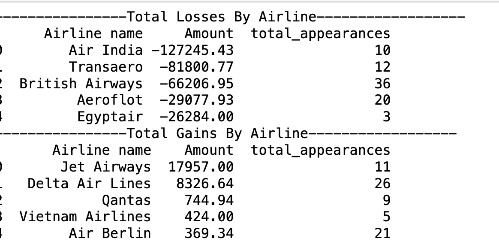
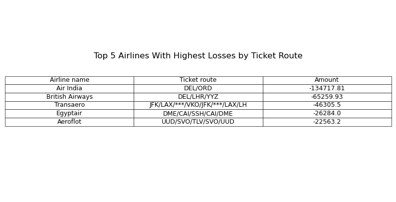
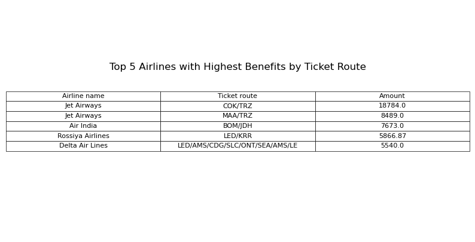

# Airline Cancellations and Changes Analysis

## About

In this project, I will be working with the CSV files in the "files" folder, which include information about new, cancelled, and changed bookings. I compiled the data into one CSV file to estimate the benefit/loss due to cancellations and changes from 14.12.2013 to 13.01.2014 (the date is in European format). All the code used in this project is contained in the IPython Notebook called "Analysis.ipynb".

## Skills Showcased

In this project, I showcased my data manipulation, data analysis, and data visualization skills using Python. I used multiple packages such as NumPy, Pandas, Matplotlib, and Seaborn. I also used SQLite to explore the data.

## Data Cleaning

I started by importing and merging all data from the "files" folder using Python. Once all the data was imported, I renamed all the columns into English to match what was given in the info.xslx file, replaced all instances of European "comma-separated" amounts in the "Amount" section with the standard "period-separated" amounts for Python to read the data, and removed all instances of duplicated data. Finally, I removed all non-flight data, filtered only cancelled and changed flights, and filtered the data to show only the issuance dates from 14.12.2013 to 13.01.2014.

## Data Exploration, Analysis and Visualization

Initially, I wanted to see if there was a difference in total benefit/loss due to cancellations/changes from different airlines, and whether there may be a correlation between the amount of benefit/loss and the total cancellations/changes.

The following SQLite output shows the top 5 losses and benefits by airline, and the amount of occurrences (cancellations/changes) from those airlines.

At first glance, there does not seem to be a significant correlation between the number of cancellations and the amount of benefit/loss. To confirm, I ran the correlation function. The correlation confirmed my belief that there was no significant correlation between the number of cancellations/changes and the amount of benefit/loss. The correlation coefficient was -0.07, which shows a negative correlation but nevertheless not a significant amount. This graph gives us better insight into the relationship between the number of cancellations/changes and the amount of benefit/loss.

As can be seen in this plot, the majority of airlines had little to no change in the benefit/loss, even if those airlines have close to 100 cancellations/changes. This can better be seen int the following histogram below:

This leads me to believe that the airlines with the most benefits/losses are outliers and not the norm. I confirmed this by identifying the outliers and found that all of the top five losses and three of the top benefits are indeed outliers

Now that we know the outliers make up most of the benefits and losses, it is time to understand why. I decided to check if it was the routes that could be costing airlines more if they were cancelled/changed. The flight routes with the highest losses are below:

What I noticed is that the top two losses, which make up the majority of the losses, are international flights. Specifically, these flights are international flights from India to North America. Cancelling international flights might cause airlines more due to higher operating costs, higher rebooking and compensation to customers, and regulatory fees. These apply especially if the cancellation/changes were done by the airline. In the winter of 2014, there were [record flight cancellation in North America due to relentless snow and ice storms.](https://www.businessinsider.com/a-record-number-of-flights-have-been-canceled-this-winter-2014-2) Furthermore, Air India which makes the majority of the losses(more than double that of the next airline, British Airways) has been having [problems with multiple flight cancellations, pilot shortage, and highly competitive airline industry which only compounds its losses](https://www.businesstoday.in/magazine/deep-dive/story/the-big-aviation-crisis-from-flight-cancellations-to-pilot-shortage-why-has-indias-aviation-story-gone-sour-427641-2024-04-30)

In contrast, four of the top five benefits are from cancellations/changes within the same country. These cancellations/changes are most likely done by the customer, as customers are more likely to cancel domestic flights rather than international flights. Because of this, customers will pay extra to cancel or change their booking. Not surprisingly, the top two benefits which make up the majority of the gains are from domestic flights from India and from the Indian airline Jet Airways.

By focusing on domestic flights, Jet Airways was better able to leverage the competitive nature of the airline industry in India.

## Conclusion

In conclusion, this analysis of airline cancellations and changes from 14.12.2013 to 13.01.2014 revealed several key insights. There is no significant correlation between the number of cancellations/changes and the amount of benefit/loss, indicating that other factors may be influencing the financial impact on airlines. The majority of airlines experienced minimal changes in benefit/loss despite varying numbers of cancellations/changes, suggesting that outliers are driving most of the financial impact.

The top two losses were from international flights, particularly from India to North America, which can incur higher costs for airlines due to operating expenses, rebooking fees, and regulatory fees. In contrast, the top benefits were from domestic flights within India, where customers are more likely to cancel or change bookings, resulting in additional revenue for airlines.

Overall, this analysis highlights the complex nature of airline economics and the importance of understanding the underlying factors influencing financial outcomes. Further research into these factors could provide valuable insights for airlines seeking to optimize their operations and mitigate financial risks associated with cancellations and changes.
