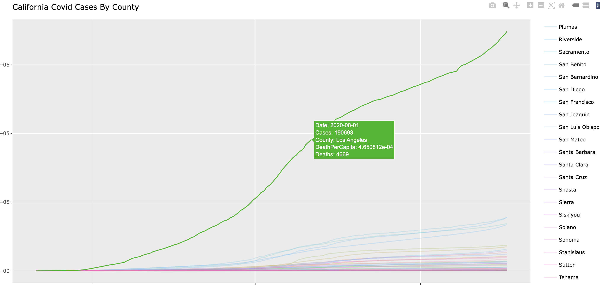
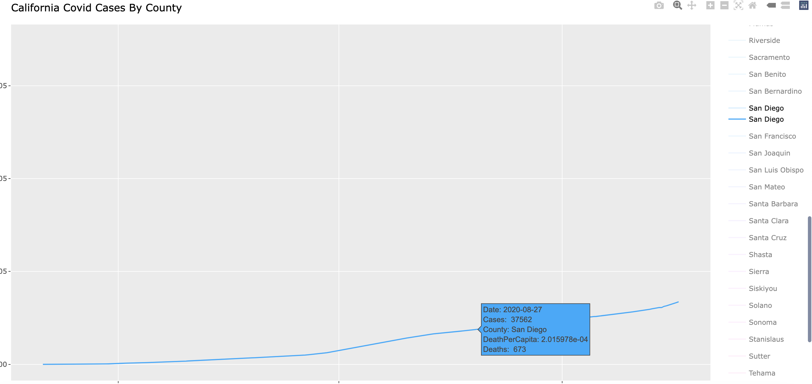

# Covid Heatmap Data Visualization

# About

I did this project to show the Covid cases in each county in California at the beginning of the pandemic. The data obtained for this project is from an API that was provided by the New York Times. I primarily used R to extract the data, transform it into a usuable format, and create a visualization. 

# Skills Showcased

In this project I showcased my data manipulation and data visualization skills I also showcase my ability to get data from an API, as well as transform it into a usuable format to be analyzed and visualized. In this project my skills in data visualization in R, as well as knowledge of HTML and Javascript are apparent.

# Output

The visualization below is the final HTML output.

I used Javascript to create a more interactive component that makes the other lines disappear if you click on an individual case line. You can also double click on the counties in the right side to see the same results.

